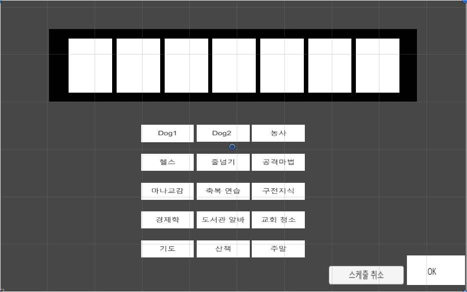
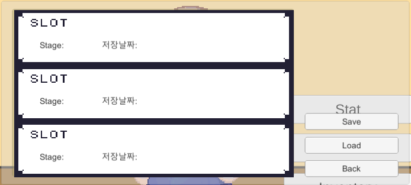
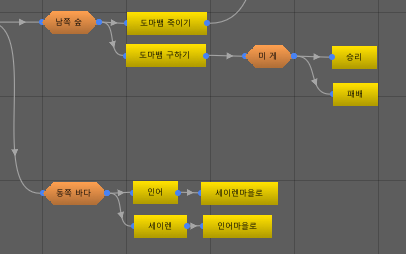
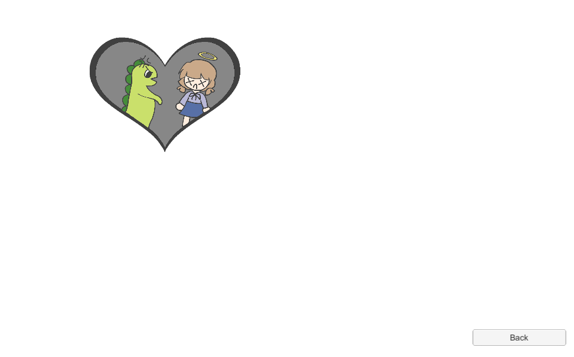
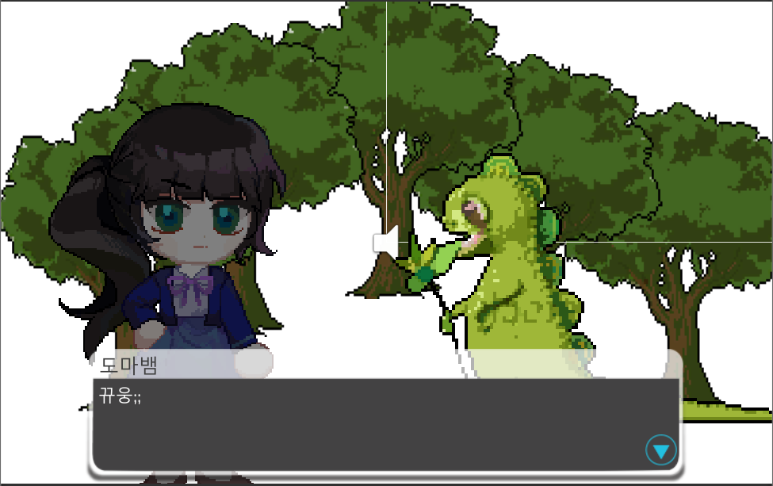

# 5주차 개발 목표

* 메인 스토리 => 100%

* UI 제작 => 100%

* 스케줄 캘린더 수정 => 100%

* 배드엔딩을 엔딩 리스트에 추가 => 100%

### 설명

* 메인 스토리 추가 작성

* UI 제작 및 적용

* 스케줄 캘린더를 일주일로 변경

* 현재까지 수집한 배드엔딩을 엔딩 리스트에서 볼 수 있음

# 5주차 작업 결과

