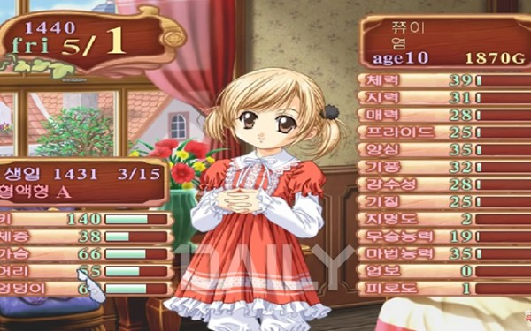
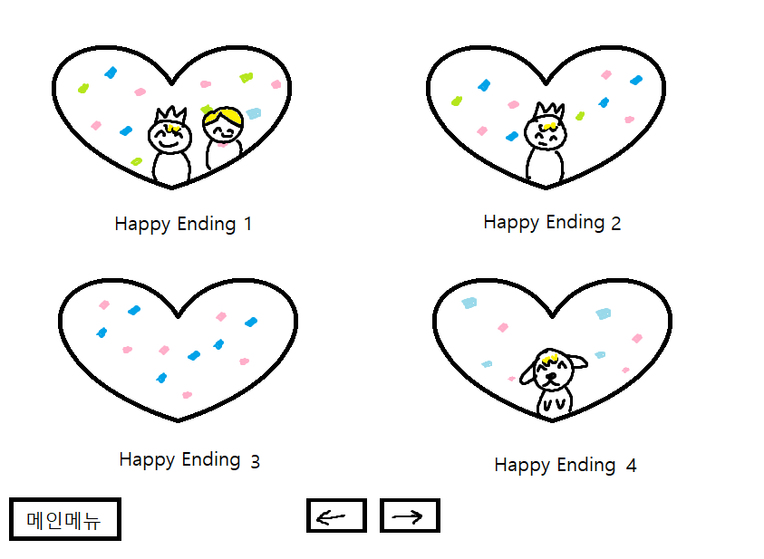
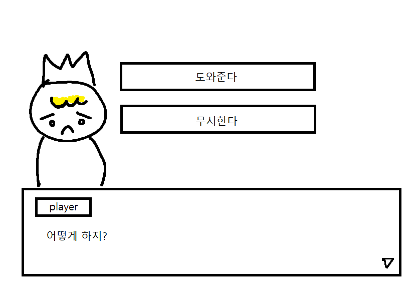
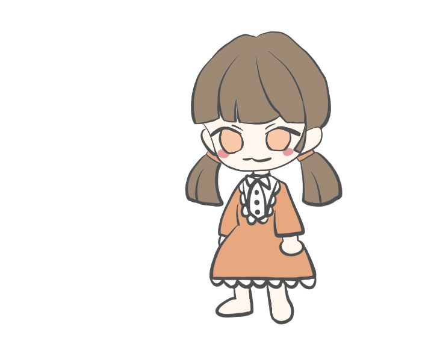
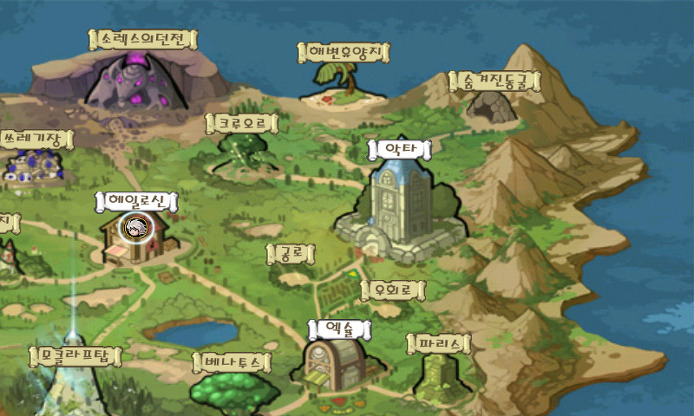
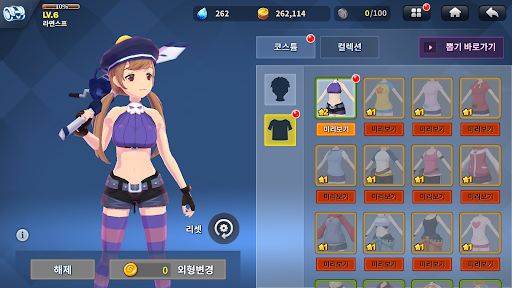
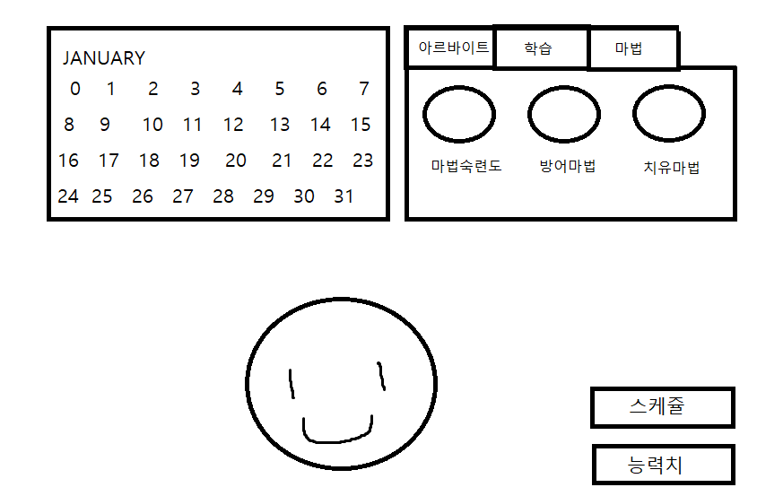
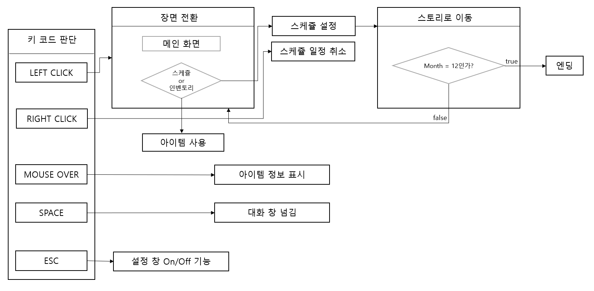
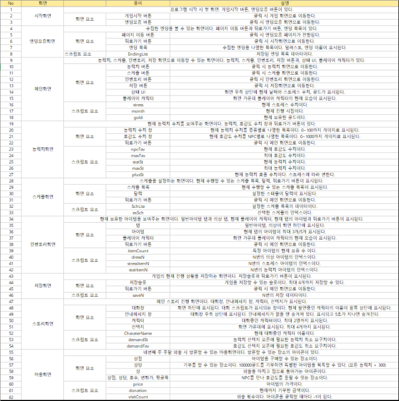
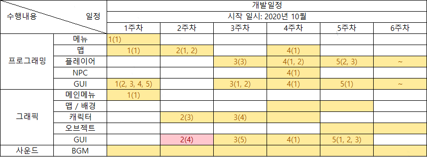

# [<b>목차</b>]  

[1. 게임명: Regina]()  
[2. 컨셉](#[컨셉])  
[3. 관련 이미지 & 동영상](#관련-이미지--동영상)  
[4. 대표 이미지](#대표-이미지)  
[5. 컨셉 & 대표이미지 기반 작품묘사](#컨셉--대표이미지-기반-작품묘사)  
[6. Regina 구성 요소](#Regina-구성-요소)  
[7. 게임 시스템 디자인](#게임-시스템-디자인)  
* [a. 게임 오브젝트 분리](#게임-오브젝트-분리)
* [b. 파라미터(속성)](#파라미터-뽑아보기)
* [c. 행동](#행동-뽑아보기)
* [d. 상태](#상태-뽑아보기)
* [e. 플레이어 캐릭터 속성(파라미터)](#플레이어-캐릭터-속성파라미터)
* [f. 게임의 규칙](#게임의-규칙)
* [g. 게임에서 사용될 공식](#게임에서-사용될-공식) 

[8. 개발 요구사항 & 흐름도](#개발-요구사항--흐름도)  
* [a. 요구사항(1년/6주)](#요구사항)
* [b. 시간별 흐름도](#시간별-흐름도)  
* [c. 키보드 이벤트에 대한 흐름도](#키보드-이벤트에-대한-흐름도)  
* [d. 용어정리](#용어정리)

[9. 스토리보드](#스토리보드)  
[10. 개발작업 일정(6주)](#개발작업-일정6주)

[[개발 1주차 목표& 작업결과]](/files/w01/w01.md)  
[[개발 2주차 목표& 작업결과]](/files/w02/w02.md)  
[[개발 3주차 목표& 작업결과]](/files/w03/w03.md)  
[[개발 4주차 목표& 작업결과]](/files/w04/w04.md)  
[[개발 5주차 목표& 작업결과]](/files/w05/w05.md)  
[[개발 6주차 목표& 작업결과]](/files/w06/w06.md)  
 
[[개발 1주차 목표& 작업결과]](/files/w01-1/w01-1.md)  
[[개발 2주차 목표& 작업결과]](/files/w02-2/w02-2.md)  
[[개발 3주차 목표& 작업결과]](/files/w03-3/w03-3.md)  
[[개발 4주차 목표& 작업결과]](/files/w04-4/w04-4.md)  
[[개발 5주차 목표& 작업결과]](/files/w05-5/w05-5.md)  
[[개발 6주차 목표& 작업결과]](/files/w06-6/w06-6.md)  
[[개발 7주차 목표& 작업결과]](/files/w07-7/w07-7.md)  
[[개발 8주차 목표& 작업결과]](/files/w08-8/w08-8.md)  
[[개발 9주차 목표& 작업결과]](/files/w09-9/w09-9.md)  
[[개발 10주차 목표& 작업결과]](/files/w10-10/w10-10.md)  
[[개발 11주차 목표& 작업결과]](/files/w11-11/w11-11.md)  

# [컨셉]

## 메인컨셉 : 스토리
* 스토리 위주의 게임
* 억울하게 누명을 쓴 부모님의 기억을 찾아서 구하는 스토리.

### 서브컨셉1 : 판타지
* 현실에서 일어날 수 없는 마법 등의 요소를 사용

### 서브컨셉2 : 관계성
* 게임 도중 만나는 NPC들과의 대화를 통해 능력치를 얻고 진행함

### 서브컨셉3 : 성장
* 스케줄을 수행하고 능력치를 쌓아 플레이어가 성장함

### 서브컨셉4 : 다양함
* 주인공의 선택, 능력치 수치에 따라 여러가지 상황에 다양한 방법으로 게임을 진행할 수 있음
* 같은 엔딩 방식(bad, happy)이더라도 다양한 상황의 엔딩 스토리가 존재

### 서브컨셉5 : 전략
* 선택지 선택에 따라 이벤트 결과가 달라짐
* 일정 분기 전에 올린 능력치에 따라 엔딩 조건이 갈림

  

# [관련 이미지 & 동영상]

* 이미지

[(https://youtu.be/QSSJmJLB4gI)](https://youtu.be/QSSJmJLB4gI)

* 동영상

  
# [대표 이미지]

* 지금까지 수집한 엔딩을 볼 수 있음

* 스토리 진행중 플레이어에게 선택지를 줌
* 선택에 따라 각각 다른 스토리 진행

  

# [컨셉 & 대표이미지 기반 작품묘사]

메인 컨셉 : 루드를 만들어 여왕 선발 시험에서 승리 / 스토리  
서브컨셉 : 판타지 / 관계성 / 성장 / 다양함 / 전략

[메인화면]  
-게임시작 버튼, 엔딩모음 버튼 존재

[능력치화면]  
-현재까지 쌓은 능력치를 볼 수 있음

[선택지화면]  
-이벤트 상황에서 플레이어의 선택지 보여줌
-선택에 따라 각각 다른 스토리 진행

[엔딩모음화면]  
-지금까지 수집한 엔딩을 볼 수 있음
-엔딩 이미지 클릭 시 해당 엔딩에 관련된 대사를 짤막하게 보여줌

# [Regina 구성 요소]

## [스토리]

여신의 선택을 받은 시트린과 메데이나 두 사람이 여왕 선발 시험을 치르는 스토리.
상대보다 강한 루드를 만들고 왕국을 지킬 힘을 갖추어 승리해야 한다.

## [메커니즘]

주인공은 매주 기술을 올려주는 수업을 들어야 함.

주인공이 배운 기술들에 따라, 게임을 진행하는 동안 나오는 선택지가 변함.

어떤 기술을 배우냐에 따라 볼 수 없는 이벤트도 있음.

 

수업을 하면 스트레스가 일정치 쌓임

스트레스 수치가 일정수준 이상 올라가면 게임 오버

스트레스 관리에 주의

 

일주일에 3개의 스케줄을 수행할 수 있음. 획득하는 능력치는 스케줄 종류에 따라 다름.

아르바이트 -> 골드 + 100 / 능력치 + 20
수업 -> 골드 - 100 / 능력치 + 50
일반 -> 능력치 + 20
휴식 -> 스트레스 - 15 ~ 30

 

일요일에는 마을에 방문해서 아이템을 구매하거나 특정 장소에 방문하여 능력치를 올릴 수 있음

 

## [디자인]

## [음향]

장소가 바뀌거나 이벤트가 발생할 때 bgm이 바뀜

# [게임 시스템 디자인]

## [게임 오브젝트 분리]

|연번|오브젝트 이름|오브젝트 이미지|  
|-----:|:-----:|-----|  
|1|플레이어 캐릭터||  
|2|마을||  
|3|아이템||  
|4|선택지||  
|5|스케쥴||  

## [파라미터 뽑아보기]

### (1) 플레이어 캐릭터
 

|속성|속성값|설명|비고|
|-----|-----|-----|-----|
|이름|시트린|주인공 캐릭터|
|나이|15||
|스트레스|0~100|캐릭터의 상태에 관련된 스탯. 스트레스가 너무 높으면 게임 진행에 문제가 생김|스케쥴을 수행하면 스트레스+10 스트레스가 100 이상 쌓이면 게임 진행 불가|
|능력치|0~1000|능력치가 있음. 일주일에 3개의 능력치를 올릴 수 있음.|포인트+ 20~50씩 획득|

### (2) 마을
 

|속성|속성값|설명|비고|
|-----|:-----:|-----|-----|
|마을|/|주말마다 방문할 수 있음. 한 스테이지에 4번 방문 가능|
|상점|/|스트레스, 능력치 관련 아이템 구매 가능|
|성당|/|기도를 통해 특별한 능력치를 쌓을 수 있음|

  

### (3) 아이템

|속성|속성값|설명|비고|
|-----|:-----:|-----|-----|
|스트레스 아이템|/|상점에서 구매 가능. 음식 아이템을 사용하여 스트레스 수치를 조절할 수 있음 |쿠키 : 스트레스-5 케이크 : 스트레스-10 스테이크 : 스트레스 -25|
|능력치 아이템|/|상점에서 구매 가능. 아이템을 사용하여 능력치를 획득할 수 있음. ||

### (4) 선택지

|속성|속성값|설명|비고|
|-----|:-----:|-----|-----|
|기본 선택지|/|스토리 진행시 기본으로 나오는 선택지
|능력치 선택지|/|능력치가 일정 수치에 도달했을 때 열리는 숨겨진 선택지

### (5) 스케쥴

|속성|속성값|설명|비고|
|-----|:-----:|-----|-----|
|학습|/|해당 스케쥴 수행시 능력치 상승
|아르바이트|/|해당 스케쥴 수행시 아이템 구매, 학습에 필요한 골드 획득
|휴식|/|아무런 스케쥴도 수행하지 않고 휴식. 스트레스 수치 감소

 

## [행동 뽑아보기]  

### 1) 오브젝트 이름: 플레이어

|행동|설명|
|:----:|:----:|
|스케쥴 설정|스케쥴 설정창에서 다음주차 행동을 선택|
|선택지 선택|메인 스토리 진행시 등장하는 대화 선택지 선택|
|외출|주말에 밖으로 외출해 아이템 구매 또는 능력치 획득|
|아이템 구매|상점에서 아이템을 구매|
|아이템 사용|인벤토리에서 보유중인 아이템을 클릭 후 사용하기 버튼을 눌러 아이템 사용|

## [상태 뽑아보기]

### 1) 오브젝트 이름:  플레이어

|현상태|전이상태|전이조건|
|:------:|:-------:|:-------:|
|정상 상태|사망|스트레스 <= 100|

## [플레이어 캐릭터 속성(파라미터)]  

|속성|영문명칭|설명|비고|
|:----:|:-------:|:----:|----|
|스트레스|stress|현재 스트레스 수치
|능력치|healthSt (능력치이름)st|플레이어가 획득한 능력치 수치|ex)Holy|
|최대 능력치|maxSt|플레이어가 획득할 수 있는 능력치의 최대치 |1000|
|능력치 효율|plusSt|스케쥴 1회 수행시 얻을 수 있는 능력치 수치
|게임 진행도|week|현재 진행중인 스테이지|
|현재 보유 아이템 개수|itemCount (아이템이름)Count|특정 아이템의 현재 보유 개수 음식 아이템에만 적용

## [게임의 규칙]

### 1) 핵심 규칙

* 플레이어는 스케쥴 설정창에서 자신이 배울 능력치를 선택할 수 있다.
* 능력치를 올려 스토리를 진행해야 한다.

### 2) 보조 규칙

* 스트레스가 100이 되면 게임오버
* 루드가 만들어지면 게임이 끝난다. 
* 스토리 분기점에서 선택지 선택에 따라 엔딩이 달라진다.
* 
## [게임에서 사용될 공식]

### (1) 능력치 >= 필요수치  
* 능력치 선택지 등장

# [개발 요구사항 & 흐름도]

## [요구사항]

* 시작 화면, 엔딩모음 화면, 메인 화면, 능력치 화면, 스케쥴 화면, 인벤토리 화면, 저장 화면, 스토리 화면, 마을 화면, 엔딩 화면 총 10개의 화면이 있다.
* 시작 화면에는 게임시작, 엔딩모음이라는 버튼 2개와 로고가 있다.
* 엔딩모음 클릭 시 엔딩모음 화면으로 이동한다.
* 엔딩모음 화면에는 엔딩이 최대 4개까지 표시되고 화살표 버튼으로 페이지를 이동할 수 있다.
* 엔딩모음 화면에는 시작 화면으로 가는 버튼이 있다.
* 게임시작 클릭 시 게임화면으로 이동한다.
* 게임은 플레이어가 사망하거나 12주차에 도달했을 때 종료한다.
* 메인 화면에는 능력치, 스케쥴, 인벤토리, 저장이라는 버튼이 있다.
* 메인 화면에는 현재 상태(주차와 스트레스 수치)가 오른쪽 위에 표시된다.
* 메인 화면의 가운데에 캐릭터의 현재 모습이 표시된다.
* 메인 화면에서 능력치 버튼을 클릭 시 능력치 화면으로 이동한다.
* 능력치 화면에는 현재 능력치 수치와 호감도 수치 창이 표시되고 뒤로가기 버튼이 있다. 뒤로가기 버튼 클릭 시 메인 화면으로 이동한다.
* 메인 화면에서 스케쥴 버튼을 클릭 시 스케쥴 화면으로 이동한다.
* 스케쥴 화면에는 현재 수행할 수 있는 스케쥴 목록과 달력이 표시된다.
* 스케쥴 목록에서 스케쥴 클릭 시 첫 날부터 스케쥴이 설정되고 저장된다.
* 스케쥴 목록에서 스케쥴 클릭 시 첫 날부터 순서대로 달력에 배치되고 스케쥴 취소 버튼을 누를 시 해당 스케쥴이 삭제된다.
* 스케쥴 화면에는 확정 버튼과 뒤로가기 버튼이 있다. 확정 버튼 클릭 시 스케쥴 실행 팝업창이 표시되고 현재 실행중인 스케쥴의 애니메이션이 실행된다. 뒤로가기 버튼 클릭 시 메인 화면으로 이동한다.
* 스케쥴 애니메이션 하단(or 우측)에 스케쥴 진행상황(성공여부, 능력치 변동사항)이 텍스트로 표시된다.
* 스케쥴 실행 후 스토리 화면으로 이동한다.
* 메인 화면에서 인벤토리 버튼을 클릭 시 인벤토리 화면으로 이동한다.
* 인벤토리 화면에는 하단에 아이템 목록이 표시된다. 일반 아이템과 의상탭이 있다. 일반 아이템 탭에는 스트레스 아이템, 능력치 아이템이 표시되고 의상 탭에는 의상만 표시된다. 뒤로가기 버튼이 있다. 뒤로가기 버튼 클릭 시 메인 화면으로 이동한다.
* 아이템에 마우스 오버를 하면 아이템 설명이 표시된다.
* 아이템 클릭 시 사용여부를 묻는 팝업창이 표시된다. 사용한다를 선택하면 아이템 개수가 줄어들고 효과가 적용된다.
* 메인 화면에서 저장 버튼을 클릭 시 저장 화면으로 이동한다.
* 저장 화면에는 저장슬롯 4개, 저장 버튼, 불러오기 버튼, 닫기 버튼이 표시된다. 슬롯을 클릭 후 저장 버튼을 누르면 해당 슬롯에 데이터가 저장 된다. 닫기 버튼 클릭 시 메인 화면으로 이동한다.
* 슬롯을 클릭 후 불러오기 버튼을 누르면 해당 슬롯의 데이터를 불러온다. 
* 스토리 화면에는 하단에 대화창이 표시된다. 대화창 양쪽 위에 캐릭터 스탠딩 일러스트가 최대 2개까지 표시된다. 화면 중간에 선택지가 최대 4개까지 표시된다.
* 대화창에는 현재 말을 하고 있는 캐릭터의 이름이 왼쪽 상단에 표시된다. 대화창을 클릭 시 대화가 넘어간다.
* 대화 진행 시 상황에 맞게 캐릭터의 표정이 변한다.
* 능력치 선택지는 능력치>요구치 일 때 표시된다.
* 선택지 선택 시 다시 대화가 진행된다.
* 잘못된 선택지를 선택 시 캐릭터가 사망하고 엔딩 화면으로 이동한다.
* 엔딩 화면에는 이번 회차에 본 엔딩 관련 설명이 표시된다. 뒤로가기 버튼이 있다. 버튼 클릭 시 시작 화면으로 이동한다.
* 마을 화면에는 여섯개의 아이콘(성, 호수, 번화가, 뒷골목, 상점, 성당, 집, 도서관)이 있다.  상점 아이콘 클릭 시 아이템을 구매 화면으로 이동한다. 성당 아이콘 클릭 시 성당에 모금을 하는 화면으로 이동한다. 집 아이콘 클릭 시 해당 주차의 외출을 종료할 수 있다.
* 외출은 일요일에 4회 할 수 있다.
* 엔딩크레딧에 사용한 BGM 출처 표시

## [요구사항(6주)]

<b>~~1. 시작 화면, 엔딩모음 화면~~</b>
  * ~~시작 화면에는 게임시작, 엔딩모음이라는 버튼 2개와 로고가 있다.~~
  * ~~엔딩모음 클릭 시 엔딩모음 화면으로 이동한다.~~
  * ~~엔딩모음 화면에는 엔딩이 최대 4개까지 표시되고 화살표 버튼으로 페이지를 이동할 수 있다.~~
  * ~~엔딩모음 화면에는 시작 화면으로 가는 버튼이 있다.~~
  * ~~게임시작 클릭 시 게임화면으로 이동한다.~~

<b>~~2. 메인 화면~~</b>
  * ~~메인 화면에는 능력치, 스케쥴, 인벤토리, 저장이라는 버튼이 있다.~~
  * ~~메인 화면의 가운데에 캐릭터의 현재 모습이 표시된다.~~
  * ~~주인공 캐릭터 디자인~~
  * ~~UI 규격 설정~~

<b>~~3. 메인 화면 기능~~</b>
  * ~~메인 화면에서 능력치 버튼을 클릭 시 능력치 화면으로 이동한다.~~
  * ~~메인 화면에서 스케쥴 버튼을 클릭 시 스케쥴 화면으로 이동한다.~~
  * ~~스케쥴 목록에서 스케쥴 클릭 시 첫주부터 스케쥴이 설정되고 저장된다.~~
  * 캐릭터 숨겨진 의상 디자인
  * ~~메인화면 버튼 UI 디자인~~
  * ~~스토리, 선택지 예시 제작~~

<b>~~4. 마을 화면~~</b>
  * ~~마을 화면에는 여섯개의 아이콘(성, 호수, 번화가, 뒷골목, 상점, 성당)이 있다.~~
  * ~~상점 아이콘 클릭 시 아이템을 구매 화면으로 이동한다.~~
  * ~~성당 아이콘 클릭 시 성당에 모금을 하는 화면으로 이동한다.~~
  * ~~성을 제외한 5개의 아이콘 모두 클릭 시 랜덤하게 NPC와 대화 화면으로 이동한다.~~
  * ~~성 아이콘 클릭 시 해당 주차의 외출을 종료할 수 있다.~~
  * ~~외출은 마지막 주 주말에 4회 할 수 있다.~~

<b>~~5. 인벤토리~~</b>
  * ~~인벤토리 화면에는 하단에 아이템 목록이 표시된다. 일반 아이템과 의상탭이 있다. 일반 아이템 탭에는 스트레스 아이템, 능력치 아이템이 표시되고 의상 탭에는 의상만 표시된다. 뒤로가기 버튼이 있다. 뒤로가기 버튼 클릭 시 메인 화면으로 이동한다.~~
  * ~~아이템 클릭 시 사용여부를 묻는 팝업창이 표시된다. 사용한다를 선택하면 아이템 개수가 줄어들고 효과가 적용된다.~~

## [요구사항2]

<b>1. 메인 화면 기능</b>
  * 현재 능력치를 게이지로 표시
  * 저장
     * xml 파일로 현재 데이터를 저장
     * 슬롯으로 저장 데이터를 여러개 생성할 수 있음
  * 인벤토리
     * 아이템을 구매한 순서대로 인벤토리에 배치
     * 현재 아이템 개수를 아이템 우측 상단에 표시
     * 아이템의 개수가 0이 되면 인벤토리에서 사라짐
     * 아이템에 마우스 오버를 하면 해당 아이템의 정보가 표시됨

<b>2. 스토리</b>
  * 메인 스토리 제작
     * 스토리 분기점 제작

  * NPC 스토리 제작
  * 엔딩 스토리 제작
     * 각 분기점에 따른 엔딩 제작

<b>3. 엔딩 모음</b>
  * 수집한 엔딩의 일러스트를 엔딩 리스트에 저장
     * 엔딩 리스트에서 보고싶은 엔딩을 선택해 다시 볼 수 있음.

<b>4. 사운드</b>
  * 버튼 클릭 시 사운드 삽입
  * BGM 삽입

## [시간별 흐름도]

## [키보드 이벤트에 대한 흐름도]

## [용어정리]

# [스토리보드]

# [개발작업 일정(6주)]

  
